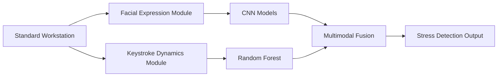

# 🧠 Stress-Scape: Multimodal AI Framework for Non-Invasive Stress Detection

<div align="center">

[](https://www.python.org/)
[](https://www.tensorflow.org/)
[](https://keras.io/)
[](https://opencv.org/)
[](https://scikit-learn.org/)

[](https://github.com/Sahilsonii/stress-detector/stargazers)
[](https://github.com/Sahilsonii/stress-detector/network)
[](https://github.com/Sahilsonii/stress-detector/issues)

**A privacy-preserving, software-only system for real-time workplace stress detection using facial expressions and keystroke dynamics.**

[📖 Research Paper](#-research-paper) • [🚀 Quick Start](#-quick-start) • [📊 Results](#-performance-results) • [💻 Demo](#-usage-examples) • [🤝 Contributing](#-contributing)

</div>

---

## 🌟 Overview

**Stress-Scape** is a comprehensive multimodal artificial intelligence framework designed for **non-invasive, real-time stress detection** in workplace environments. Unlike traditional wearable-based systems that cost $200-500 per device and raise privacy concerns, this solution uses only software-based indicators from standard workstations.

### 🎯 Key Highlights

- 🚫 **No Wearable Sensors Required** - Eliminates hardware costs and user discomfort
- 🔒 **Privacy-Preserving** - All processing happens locally on user workstations
- ⚡ **Real-Time Performance** - 25-30 FPS on CPU, 80-100 FPS on GPU
- 🎯 **High Accuracy** - ~89% accuracy across both modalities
- 💰 **Cost-Effective** - Software-only solution deployable on standard workstations
- 🌐 **Scalable** - No infrastructure investment required

---

## 🏗️ System Architecture



### 🎭 Facial Expression Modality

- **Models:** MobileNetV2, EfficientNetB0, ResNet50V2
- **Dataset:** 53,571 augmented facial images
- **Emotions:** 7 categories (angry, disgust, fear, happy, neutral, sad, surprise)
- **Binary Mapping:**
  - **Stressed:** angry, disgust, fear, sad, neutral
  - **Not Stressed:** happy, surprise
- **Training:** Two-phase transfer learning (30 + 10 epochs)

### ⌨️ Keystroke Dynamics Modality

- **Algorithm:** Random Forest Ensemble Classifier
- **Dataset:** CMU Keystroke Dynamics Benchmark (51 participants, 400 samples each)
- **Features:**
  - Error Rate (backspace count / total words)
  - Backspace Frequency
  - Typing Patterns
- **Validation:** Group-aware cross-validation to prevent data leakage

---

## 📊 Performance Results

### 🏆 Best Performing Models

#### Facial Expression: ResNet50V2

| Metric | Score |
|--------|-------|
| **Accuracy** | **89%** |
| **Precision** | **0.95** |
| **Recall** | **0.89** |
| **F1-Score** | **0.92** |
| **AUC-ROC** | **0.83** |

#### Keystroke Dynamics: Random Forest

| Metric | Score |
|--------|-------|
| **Accuracy** | **84.56% ± 1.68%** |
| **Precision** | **0.92** (at threshold 0.65) |
| **Recall** | **0.8567** |
| **F1-Score** | **0.88** |

### 📈 Model Comparison

| Model | Modality | Accuracy | Precision | Recall | F1-Score | AUC |
|-------|----------|----------|-----------|--------|----------|-----|
| **ResNet50V2** ⭐ | Facial | **0.89** | **0.95** | **0.89** | **0.92** | 0.83 |
| MobileNetV2 | Facial | 0.85 | 0.94 | 0.84 | 0.89 | **0.94** |
| EfficientNetB0 | Facial | 0.81 | 0.94 | 0.78 | 0.85 | 0.75 |
| **Random Forest** ⭐ | Keystroke | **0.8456** | 0.87 | 0.81 | 0.84 | - |
| Decision Tree | Keystroke | 0.7645 | 0.78 | 0.75 | 0.76 | - |

**Performance Improvement:** Random Forest outperforms Decision Tree baseline by **8.11 percentage points**

---

## 📦 Dataset Information

### 🎭 Facial Expression Dataset

- **Total Images:** 53,571
  - Training: 40,096
  - Validation: 13,475
- **Sources:**
  1. FER2013 public benchmark (~35,887 images)
  2. Custom-collected data (1,400 images from real users)
- **Resolution:** 224×224 pixels
- **Augmentation Techniques:**
  - Rotation (±20°)
  - Width/Height shifts (±20%)
  - Shear transformation (15° max)
  - Zoom (±15%)
  - Horizontal flipping (50% probability)
  - Brightness adjustment (±20%)

### ⌨️ Keystroke Dataset

- **Source:** CMU Keystroke Dynamics Benchmark
- **URL:** https://www.cs.cmu.edu/~keystroke/
- **Participants:** 51
- **Samples:** 400 per participant
- **Features:** backspace count, total words typed, error rate
- **Split Strategy:** Group-aware (60% train, 20% val, 20% test)

---

## 🚀 Quick Start

### 📋 Prerequisites

- Python 3.8+
- NVIDIA GPU (optional, for faster training)
- Webcam (for real-time facial detection)

### 🔧 Installation

```bash
# Clone the repository
git clone https://github.com/Sahilsonii/stress-detector.git
cd stress-detector

# Create virtual environment
python -m venv venv
source venv/bin/activate  # On Windows: venv\Scripts\activate

# Install dependencies
pip install -r requirements.txt
```

### 📦 Requirements

```txt
tensorflow==2.10.1
keras==2.10.0
opencv-python==4.6.0.66
numpy==1.23.3
scikit-learn==1.1.2
scipy==1.9.1
matplotlib==3.6.0
pandas==1.5.1
pillow==9.2.0
```

---

## 💻 Usage Examples

### 🎭 Train Facial Expression Model

```bash
# Train MobileNetV2
python train_mobilenet.py --epochs 40 --batch_size 8 --learning_rate 0.001

# Train EfficientNetB0
python train_efficientnet.py --epochs 40 --batch_size 8

# Train ResNet50V2
python train_resnet.py --epochs 40 --batch_size 8
```

### ⌨️ Train Keystroke Model

```bash
python train_keystroke_rf.py --dataset data/cmu_keystroke.csv --n_estimators 100
```

### 🎥 Real-Time Stress Detection

```bash
# Facial stress detection via webcam
python webcam_stress_detector.py --model models/resnet50v2_best.h5

# Keystroke stress monitoring
python keystroke_monitor.py --model models/random_forest.pkl
```

### 🔗 Multimodal Fusion

```python
from stress_detector import MultimodalStressDetector

# Initialize detector
detector = MultimodalStressDetector(
    facial_model='models/resnet50v2_best.h5',
    keystroke_model='models/random_forest.pkl'
)

# Get predictions
facial_pred = detector.predict_facial(frame)
keystroke_pred = detector.predict_keystroke(typing_data)

# Fuse predictions
final_stress_score = detector.fuse_predictions(
    facial_pred, 
    keystroke_pred, 
    method='late_fusion'
)

print(f"Stress Level: {final_stress_score:.2f}")
```

---

## 📁 Project Structure

```
stress-detector/
├── data/
│   ├── facial_expressions/
│   │   ├── train/
│   │   └── validation/
│   └── keystroke/
│       └── cmu_keystroke.csv
├── models/
│   ├── mobilenetv2_model.py
│   ├── efficientnet_model.py
│   ├── resnet50v2_model.py
│   ├── random_forest_model.py
│   └── multimodal_fusion.py
├── training/
│   ├── train_mobilenet.py
│   ├── train_efficientnet.py
│   ├── train_resnet.py
│   └── train_keystroke_rf.py
├── inference/
│   ├── webcam_stress_detector.py
│   ├── keystroke_monitor.py
│   └── multimodal_detector.py
├── utils/
│   ├── data_augmentation.py
│   ├── preprocessing.py
│   └── evaluation.py
├── results/
│   ├── confusion_matrices/
│   ├── training_history/
│   └── performance_metrics/
├── requirements.txt
└── README.md
```

---

## 🎯 Research Contributions

1. ✅ **Software-Based System** - Completely eliminates wearable sensor dependencies
2. ✅ **Comprehensive Model Comparison** - Rigorous evaluation of 3 CNN architectures
3. ✅ **Ensemble vs Single-Tree Analysis** - Demonstrates Random Forest superiority
4. ✅ **Novel Feature Engineering** - Keystroke-based stress proxies from raw data
5. ✅ **Behavioral Modality Validation** - Typing patterns as stress indicators
6. ✅ **Deployment-Ready Architecture** - Real-time processing with temporal smoothing

---

## ⚖️ Ethical Framework

This research adheres to five fundamental ethical principles:

### 🔐 Principle 1: Informed Consent
All participants are explicitly informed about data collection methods before monitoring begins. Users can opt out without penalties.

### 🎯 Principle 2: Purpose Limitation
Data is used only for workplace wellness, never for performance reviews or hiring decisions.

### 💾 Principle 3: Local Storage & Minimization
All processing occurs locally with encrypted storage. No data transmitted to cloud infrastructure.

### 🔒 Principle 4: Pseudonymization & Anonymization
Stress logs contain no personally identifiable information. User identifiers use cryptographic hashing.

### 👤 Principle 5: Human Supervision
Automated predictions are informational only, supplementing (not replacing) human judgment.

---

## ⚠️ Known Limitations

| Limitation | Impact | Mitigation Strategy |
|------------|--------|---------------------|
| **Dataset Bias** | 4-7% accuracy drop for underrepresented demographics | Fairness-aware reweighting, diverse data collection |
| **Proxy Label Validity** | Lack of physiological validation | External validation with cortisol/HRV measurements |
| **Temporal Dynamics** | Misses stress evolution over time | Implement LSTM/GRU temporal architectures |
| **Domain Shift** | 12-18% accuracy drop in real-world deployment | Domain adaptation techniques, workplace-specific data |

---

## 🔮 Future Research Directions

- 🔄 **Multimodal Fusion** - Investigate early, intermediate, and late fusion architectures
- ⏱️ **Temporal Modeling** - Implement LSTM/GRU for stress evolution tracking
- 🌐 **Domain Adaptation** - Bridge controlled-to-naturalistic environment gaps
- 🧬 **Physiological Validation** - Validate proxies against cortisol, HRV, EDA markers
- ⚖️ **Fairness-Aware ML** - Ensure equitable performance across demographics

---

## 🛠️ Hardware Requirements

### Minimum Requirements
- **CPU:** Intel Core i5 (8th gen) or equivalent
- **RAM:** 8GB
- **Storage:** 10GB free space
- **GPU:** Optional (CPU inference supported)

### Recommended Requirements
- **CPU:** Intel Core i7 (11th gen) or equivalent
- **RAM:** 16GB DDR4
- **Storage:** 512GB SSD
- **GPU:** NVIDIA RTX 3050ti (4GB VRAM) or better

---

## 📊 Deployment Recommendations

### For Workplace Implementation

1. **ResNet50V2** for facial detection (60-second snapshots)
2. **Random Forest** for keystroke analysis (15-minute windows)
3. **10-frame temporal smoothing** for stability
4. **Personal dashboards** for employee self-awareness (not surveillance)
5. **Annual consent re-evaluation**
6. **Complete data deletion mechanisms**
7. **Integration with employee assistance programs**

---

## 🤝 Contributing

We welcome contributions! Here are areas where you can help:

- 🔀 Fusion strategies (early/intermediate/late)
- 🧠 LSTM/GRU temporal modeling
- 🌐 Domain adaptation techniques
- ⚖️ Fairness-aware training methods
- 📊 Additional behavioral modalities
- 🐛 Bug fixes and performance improvements
---

## 🙏 Acknowledgments

- **FER2013 Dataset** - Kaggle community
- **CMU Keystroke Dynamics Benchmark** - Carnegie Mellon University
- **Transfer Learning Models** - TensorFlow/Keras pre-trained weights
- **Research Community** - For valuable feedback and insights

## ⭐ Star History

If this project helps your research or work, please consider giving it a star! ⭐

<div align="center">

**Made with ❤️ for workplace wellness and mental health**

[⬆ Back to Top](#-stress-scape-multimodal-ai-framework-for-non-invasive-stress-detection)

</div>
